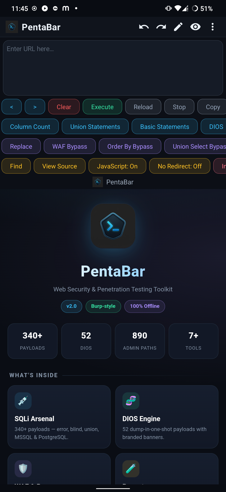
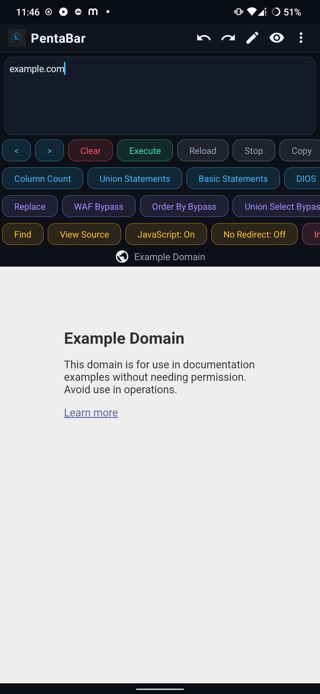
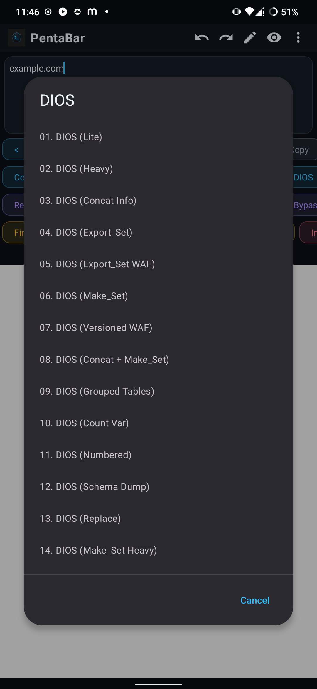
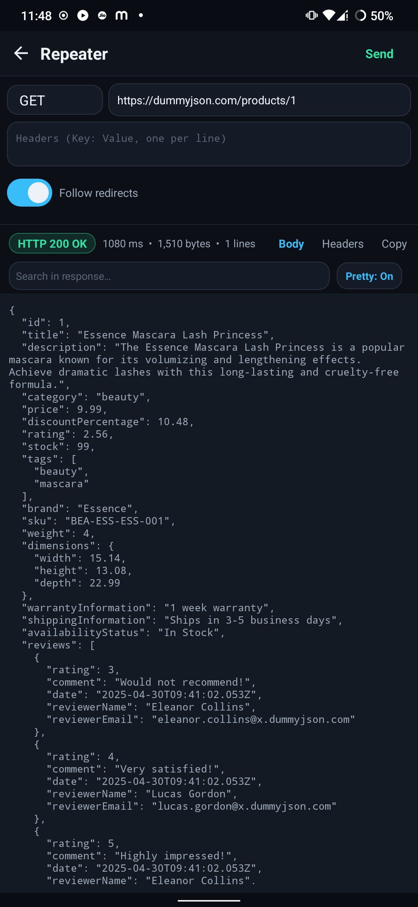
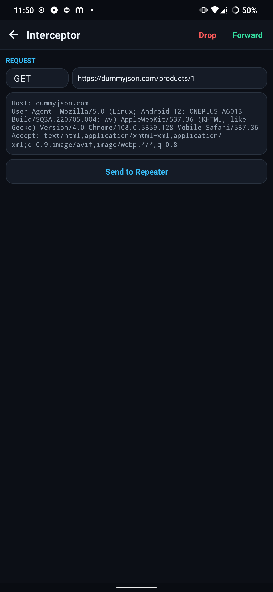

# PentaBar

**Web Security &amp; Penetration Testing Toolkit for Android**

A clean, offline, ad-free pentesting browser for **bug bounty &amp; web security testing** —
SQLi arsenal, DIOS engine, a Burp-style Repeater &amp; Interceptor, HTTP history and a modern,
distraction-free UI.

---

## Overview

PentaBar pairs an in-app **WebView browser** with a one-tap payload toolbar and a set of
professional-grade tools usually found only on the desktop. Built for **bug bounty hunters and
penetration testers** who want to recon, test and verify web vulnerabilities right from their
phone. Everything runs **locally on the device** — no accounts, no ads, no telemetry, no
network calls of its own.

> ⚠️ **For authorised security testing and education only.** Use PentaBar only on systems you
> own or have explicit written permission to test. You alone are responsible for your usage.

---

## Screenshots

| Home | Browser + Toolbar | DIOS Arsenal |
|:---:|:---:|:---:|
|  |  |  |

| Repeater &amp; Pretty Print | Interceptor (Burp-style) |
|:---:|:---:|
|  |  |

---

## Features

#### Payload arsenal
- **340+ SQLi payloads** — error, blind, union, double-query, XPath, MSSQL &amp; PostgreSQL
- **52 DIOS** dump-in-one-shot payloads with branded banners
- **WAF &amp; bypass kit** — WAF, Order-By, Union-Select, Auth bypass, LFI/RFI, RCE, XSS
- One-tap insertion at the cursor, organised into clean scrollable rows

#### Pro tools
- **Repeater** — craft &amp; replay any request, inspect raw status, headers, body, timing &amp; size
- **Interceptor** — capture and modify live requests/responses, forward, drop or send to Repeater
- **HTTP History** — full request/response log with search, replay &amp; one-tap clear (toggleable)
- **Pretty Print** — auto-format JSON / XML / HTML responses, on by default with an instant toggle
- **Admin Finder** — 890-path scan with threads, filters, import &amp; export
- **Extract Links** — pull every link, image &amp; script from a page; tap to copy

#### Browser &amp; UX
- Smart **favicon** — shows the site's own icon, a globe fallback, or the PentaBar logo at home
- Encoders, custom queries, find-in-page, view-source, file downloads &amp; user-agent switching
- A modern, aesthetic landing page and a clean dark Material theme

---

## Download &amp; Install

1. Grab the latest **`PentaBar-vX.Y.apk`** from the [**Releases**](../../releases) page.
2. Open it on your Android device and allow installation from this source if prompted.
3. Installs on **Android 7 through 16** — no Play Store required.

The APK ships as a **signed release build** (v1 + v2 + v3 signature schemes) for clean
installation across modern Android versions.

---

## Credits

**Created by [vikas0vks](https://github.com/vikas0vks)** — Developer &amp; Designer
**Special Support &amp; Credit — amit0hx**

© 2026 PentaBar · Built for security researchers

